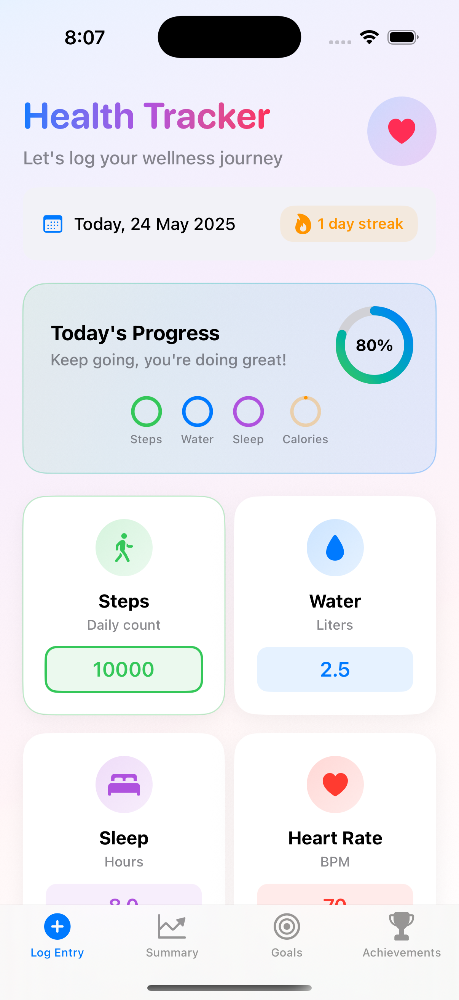
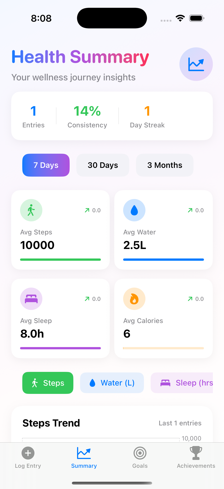
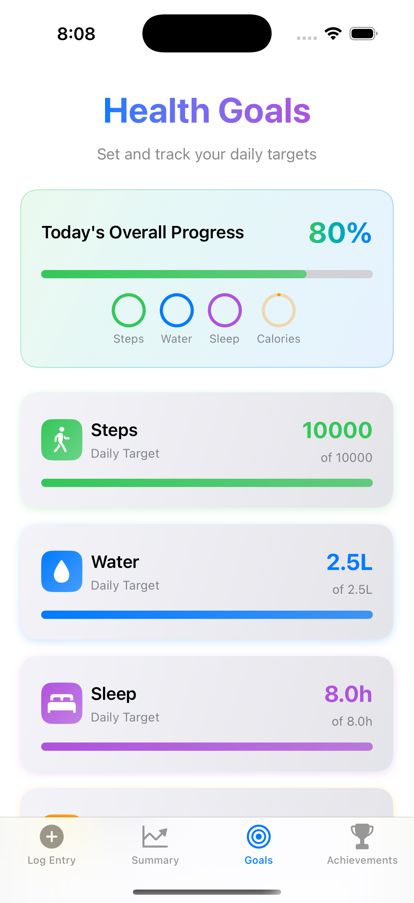
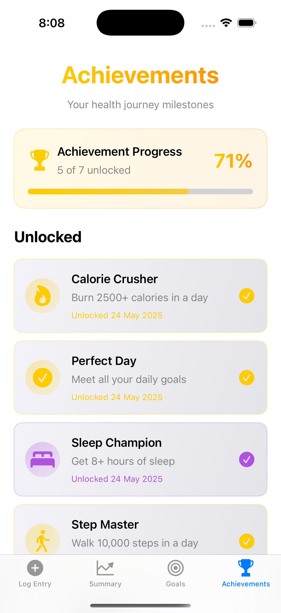

# HealthTrack2 🏃‍♂️💪

<div align="center">
  
  
  
  
</div>

<br>

<div align="center">
  <h3>🌟 Your Complete Health & Wellness Companion 🌟</h3>
  <p><em>Transform your daily wellness journey with beautiful design, smart insights, and gamified progress tracking</em></p>
</div>

---

## 📱 Screenshots

<div align="center">
  <table>
    <tr>
      <td align="center">
        
        <br>
        <sub><b>📝 Daily Health Log</b></sub>
      </td>
      <td align="center">
        
        <br>
        <sub><b>📊 Health Summary</b></sub>
      </td>
      <td align="center">
        
        <br>
        <sub><b>🎯 Goals Tracking</b></sub>
      </td>
      <td align="center">
        
        <br>
        <sub><b>🏆 Achievements</b></sub>
      </td>
    </tr>
  </table>
</div>

---

## ✨ Features

### 🎨 **Enhanced UI Design**
- **Modern Gradients** - Beautiful color transitions throughout the app
- **Smooth Animations** - Delightful micro-interactions and transitions
- **Responsive Layout** - Optimized for all iOS device sizes
- **Card-Based Design** - Clean, organized information presentation
- **Dark/Light Mode** - Seamless theme adaptation

### 📊 **Comprehensive Health Tracking**
- **👟 Steps Counter** - Daily step tracking with goal progress
- **💧 Water Intake** - Hydration monitoring in liters
- **😴 Sleep Hours** - Sleep quality and duration tracking
- **❤️ Heart Rate** - BPM monitoring and trends
- **🔥 Calories Burned** - Daily calorie expenditure
- **⚖️ Weight Tracking** - Weight management over time
- **😊 Mood Tracking** - Daily emotional wellness logging

### 🎯 **Smart Goals System**
- **Customizable Targets** - Set personalized daily goals
- **Real-time Progress** - Live tracking with beautiful progress rings
- **Achievement Notifications** - Celebrate when you hit your targets
- **Adaptive Recommendations** - Smart suggestions based on your data

### 🏆 **Gamification & Achievements**
- **Progress Badges** - Unlock achievements for consistency
- **Streak Tracking** - Build healthy habits with daily streaks
- **Milestone Rewards** - Special badges for major accomplishments
- **Social Sharing** - Share your achievements with friends

### 📈 **Advanced Data Visualization**
- **Interactive Charts** - Beautiful line and area charts
- **Trend Analysis** - Spot patterns in your health data
- **Time Range Selection** - View data by week, month, or custom periods
- **Comparative Insights** - See how you're improving over time

### 🧠 **Health Insights**
- **Personal Analytics** - Your best performing days and metrics
- **Consistency Scores** - Track your dedication to healthy habits
- **Smart Recommendations** - AI-powered suggestions for improvement
- **Detailed Summaries** - Comprehensive health reports

---

## 🚀 Getting Started

### Prerequisites
- iOS 16.0+
- Xcode 14.0+
- Swift 5.0+

### Installation

1. **Clone the repository**
   ```bash
   git clone https://github.com/yourusername/HealthTrack2.git
   cd HealthTrack2
   ```

2. **Open in Xcode**
   ```bash
   open HealthTrack2.xcodeproj
   ```

3. **Build and Run**
   - Select your target device or simulator
   - Press `Cmd + R` to build and run

---

## 🏗️ Architecture

### 🎯 **SwiftUI + MVVM Pattern**
```
HealthTrack2/
├── 📱 Views/
│   ├── InputView.swift          # Daily health logging
│   ├── SummaryView.swift        # Data visualization & analytics
│   ├── GoalsView.swift          # Goal setting & tracking
│   └── AchievementsView.swift   # Badges & achievements
├── 🧠 Models/
│   ├── HealthEntry.swift        # Core data model
│   ├── HealthDataStore.swift    # Data persistence
│   ├── GoalsManager.swift       # Goals management
│   └── AchievementsManager.swift # Achievement system
├── 🎨 Components/
│   └── SharedComponents.swift   # Reusable UI components
└── 📱 App/
    ├── HealthTrack2App.swift    # App entry point
    └── ContentView.swift        # Main tab navigation
```

### 🔧 **Key Technologies**
- **SwiftUI** - Modern declarative UI framework
- **Combine** - Reactive programming for data flow
- **UserDefaults** - Local data persistence
- **Charts Framework** - Beautiful data visualizations
- **SF Symbols** - Consistent iconography

---

## 🌟 Key Highlights

### 💫 **User Experience**
- **Intuitive Navigation** - Easy-to-use tab-based interface
- **Quick Entry** - Log your health data in seconds
- **Visual Feedback** - Immediate response to user actions
- **Accessibility** - VoiceOver and accessibility support

### 🎨 **Design Philosophy**
- **Minimalist Approach** - Clean, distraction-free interface
- **Color Psychology** - Thoughtful use of colors for different metrics
- **Typography** - Clear, readable fonts with proper hierarchy
- **Spacing & Layout** - Generous whitespace for comfortable viewing

### 📊 **Data Management**
- **Local Storage** - Your data stays on your device
- **Privacy First** - No external data collection
- **Backup Ready** - Easy to extend with iCloud sync
- **Performance Optimized** - Smooth scrolling and quick responses

---

## 🤝 Contributing

We welcome contributions! Here's how you can help:

1. **Fork the repository**
2. **Create a feature branch** (`git checkout -b feature/AmazingFeature`)
3. **Commit your changes** (`git commit -m 'Add some AmazingFeature'`)
4. **Push to the branch** (`git push origin feature/AmazingFeature`)
5. **Open a Pull Request**

### 🐛 **Bug Reports**
If you find a bug, please create an issue with:
- Device and iOS version
- Steps to reproduce
- Expected vs actual behavior
- Screenshots if applicable

---

## 📋 **Roadmap**

### 🔮 **Upcoming Features**
- [ ] **Apple Health Integration** - Sync with HealthKit
- [ ] **Widget Support** - Home screen widgets for quick data
- [ ] **Export Features** - PDF reports and data export
- [ ] **Reminders** - Smart notifications for logging
- [ ] **Social Features** - Connect with friends and family
- [ ] **Advanced Analytics** - Machine learning insights
- [ ] **Workout Integration** - Exercise tracking and planning
- [ ] **Nutrition Tracking** - Calorie and macro monitoring

### 🎯 **Next Version (v2.0)**
- **Cloud Sync** - Cross-device data synchronization
- **Premium Features** - Advanced analytics and insights
- **Customizable Dashboard** - Personalized home screen
- **Third-party Integrations** - Fitness apps and devices

---

## 📄 License

This project is licensed under the MIT License - see the [LICENSE](LICENSE) file for details.

---

## 🙏 Acknowledgments

- **Apple** - For the amazing SwiftUI framework
- **SF Symbols** - For the beautiful iconography
- **Design Inspiration** - Modern health and fitness apps
- **Open Source Community** - For continuous inspiration and learning

---

<div align="center">
  <h3>🌟 Made with ❤️ and SwiftUI 🌟</h3>
  <p><em>Transforming health tracking, one day at a time</em></p>
  
  <br>
  
  **⭐ Star this repo if you found it helpful! ⭐**
  
  <br>
  
  <a href="https://twitter.com/yourusername">
    
  </a>
</div>